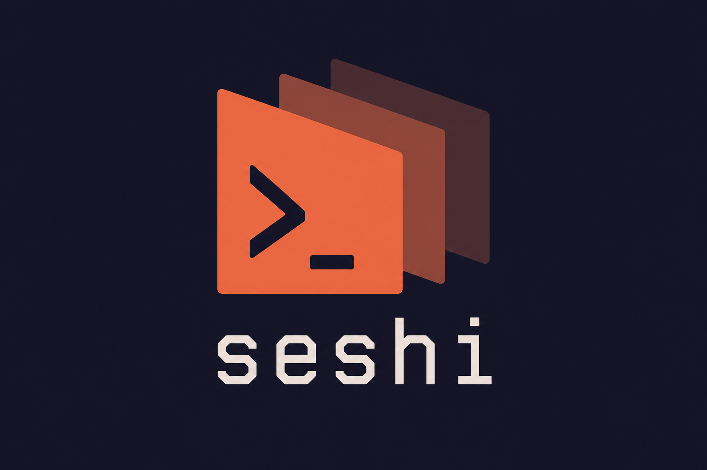

<p align="center">
  
</p>

<p align="center">
  <strong>Global session manager and resumer for Claude Code</strong>
</p>

<p align="center">
  Capture, search, tag, and resume any Claude Code session from anywhere.
</p>

---

Seshi hooks into Claude Code's session lifecycle, indexes every session into a local registry, and gives you a TUI and CLI to find and resume them instantly.

- Automatic session capture via Claude Code hooks
- Fuzzy search across session names, prompts, directories, and full transcript content (FTS5)
- Tag, rename, favorite, and archive sessions
- Resume any session from any directory with a single command
- Interactive TUI with multiple views (sessions, overview, projects, help)
- Backfill existing sessions from Claude Code transcripts on disk

## Install

Requires Python 3.12+ and [uv](https://docs.astral.sh/uv/).

### Run without installing

```sh
uvx --from git+https://github.com/agentshed/seshi.git seshi
```

### Install as a global tool

```sh
uv tool install git+https://github.com/agentshed/seshi.git
```

Or install from a local checkout:

```sh
uv tool install .
```

### Development

```sh
git clone https://github.com/agentshed/seshi.git
cd seshi
uv sync
uv run seshi
```

## Setup

### 1. Initialize

Run the doctor to set up the hook, database, and settings:

```sh
seshi doctor --fix
```

This will:
- Create `~/.seshi/` directory
- Install the hook script
- Initialize the session database
- Patch `~/.claude/settings.json` to register the hook

### 2. Shell wrapper

Add this to your shell rc file (`~/.zshrc`, `~/.bashrc`, or `~/.config/fish/config.fish`):

```sh
eval "$(seshi init)"
```

This enables `cd` into the project directory when resuming a session, plus tab completion.

### 3. Backfill existing sessions

```sh
seshi scan
```

Discovers sessions from Claude Code's transcript files already on disk.

## Usage

### TUI

```sh
seshi              # Open the interactive session picker
seshi --here       # Filter to sessions in the current directory
```

Navigate with `j`/`k` or arrow keys. Press `Enter` to resume. Press `?` for the full keymap.

### Quick resume

```sh
seshi last          # Resume the most recent session
seshi <query>       # Fuzzy search and resume (e.g. seshi auth)
seshi resume <name> # Resume by exact name or ID
```

### Session management

```sh
seshi list                  # List all sessions
seshi list --json           # JSON output for scripting
seshi rename <id> <name>    # Name a session for quick access
seshi tag <id> <tag>        # Add a tag
seshi favorite <id>         # Pin to top
seshi archive <id>          # Soft-delete (reversible)
seshi delete <id> --force   # Remove from registry
```

### Search and export

```sh
seshi grep "websocket"              # Search across all transcripts
seshi grep "auth" --here --limit 5  # Search in current project
seshi export <id> --md              # Export as markdown
seshi export <id> --json            # Export as JSON
```

### Utilities

```sh
seshi stats             # Session counts, tokens, estimated cost
seshi auto-name --all   # Generate names for unnamed sessions via Claude
seshi theme nord        # Switch TUI color theme
seshi doctor            # Health check
seshi prune --dry-run   # Preview cleanup of old sessions
```

### Themes

Five built-in palettes: `coral` (default), `catppuccin`, `gruvbox`, `nord`, `mono`.

```sh
seshi theme list    # Preview all themes
seshi theme <name>  # Switch theme
seshi theme reset   # Restore default
```

## How it works

1. A hook script fires on every Claude Code `SessionStart` and `Stop` event
2. Session metadata (cwd, argv, git state, tokens, first prompt) is appended to a local queue
3. On every `seshi` invocation, the queue is drained into a SQLite database
4. The TUI and CLI query the database for searching, filtering, and sorting
5. Resuming emits `cd <dir> && exec claude --resume <id>` which the shell wrapper `eval`s

## Uninstall

```sh
seshi uninstall          # Remove hook and settings patch
seshi uninstall --purge  # Also delete ~/.seshi/ (database, queue, hook)
```

## License

Apache-2.0
